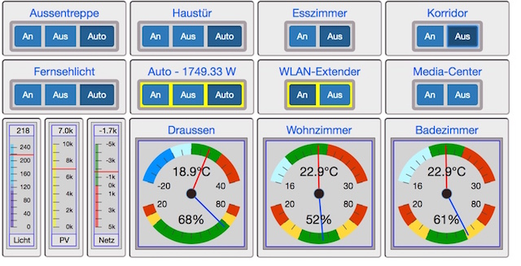
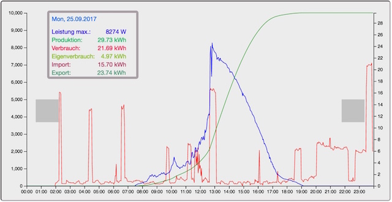

# homeview
Simple frontend for an ioBroker based home control and automation system.

## Getting started

- install node > V7.0

- checkout and setup homeview

      git clone https://github.com/rgwch/homeview
      cd homeview
      [sudo] npm install -g aurelia-cli
      npm install
      au run --watch
    
- point your browser (recommended: chrome) to `localhost:9000/#/showcase`    

## Building deployment version

Change values in globals.ts: Set mock to false to use a real iobroker and adjust the iobroker address and port accordingly. Then:

    au build --env prod
    
After build, copy `index.html`  and the folders `source` and `styles` to the deployment server    

Of course, everything except "showcase" needs major refactoring to work in a specific environment.
So, this is rather an idea on how to get started, than a ready-to-use app.
